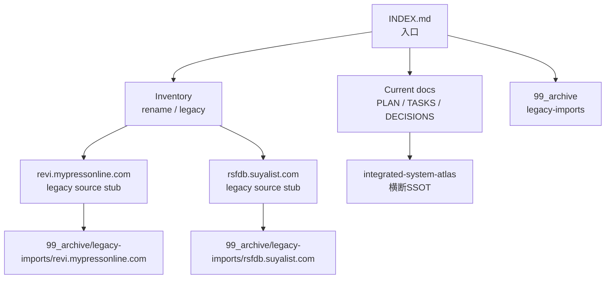

# RSFDS Docs Structure

**Status**: `active`
**Last Updated**: 2026-06-20

この文書は、`ReuseShop-Database-System/docs/` 配下の整理方針を定義する。

このrepoはRSFDS親repoであり、実装詳細の正本ではなく、3repo体制・横断方針・計画・棚卸しを扱う。

## 基本方針

- 現行docsとlegacy docsを混ぜない。
- 仕様書、計画、タスク、意思決定、作業ログ、旧資料を分離する。
- 秘密情報候補を含む可能性がある旧資料は、全文確認や本文転記を避ける。
- 旧資料は `99_archive/legacy-imports/` を整理先として扱う。
- 判断不能なものは `REVIEW_REQUIRED` として残す。

## 推奨構成

| 区分 | 役割 | 現在の代表ファイル |
|---|---|---|
| Entry | 入口・MOC | `INDEX.md`, root `README.md` |
| Planning | 計画・優先度 | `PLAN.md` |
| Tasks | タスク・状態管理 | `TASKS.md` |
| Decisions | 決定・根拠 | `DECISIONS.md` |
| Inventory | 棚卸し・移行前確認 | `REPOSITORY_RENAME_INVENTORY.md`, `LEGACY_DOCS_INVENTORY.md` |
| Archive | 旧資料の閉じ先 | `99_archive/`, `99_archive/legacy-imports/` |
| Legacy source stubs | 旧資料の元パス誘導 | `revi.mypressonline.com/README.md`, `rsfdb.suyalist.com/README.md` |

## 現行docs

以下を現行docsとして扱う。

| ファイル | 役割 |
|---|---|
| `INDEX.md` | docs全体の入口 |
| `PLAN.md` | 親repoの計画 |
| `TASKS.md` | 親repoのタスク管理 |
| `DECISIONS.md` | 親repoの設計決定 |
| `DOCS_STRUCTURE.md` | docs整理方針 |
| `REPOSITORY_RENAME_INVENTORY.md` | repo rename前の影響範囲棚卸し |
| `LEGACY_DOCS_INVENTORY.md` | legacy docsの棚卸し |
| `99_archive/README.md` | archive入口 |

## archive構成

旧資料の整理先は以下。

```text
ReuseShop-Database-System/docs/
├── INDEX.md
├── PLAN.md
├── TASKS.md
├── DECISIONS.md
├── DOCS_STRUCTURE.md
├── REPOSITORY_RENAME_INVENTORY.md
├── LEGACY_DOCS_INVENTORY.md
└── 99_archive/
    └── legacy-imports/
        ├── revi.mypressonline.com/
        └── rsfdb.suyalist.com/
```

## legacy docs

以下は現行正本ではなく、旧プロジェクト由来の資料として扱う。

| 旧パス | archive先 | 推定由来 | 状態 |
|---|---|---|---|
| `docs/revi.mypressonline.com/` | `docs/99_archive/legacy-imports/revi.mypressonline.com/` | DIG LOG旧設計・旧実装資料 | `legacy / redirected / REVIEW_REQUIRED` |
| `docs/rsfdb.suyalist.com/` | `docs/99_archive/legacy-imports/rsfdb.suyalist.com/` | 旧RSFD / HDF時代の資料 | `legacy / redirected / REVIEW_REQUIRED` |

旧パス側にはstub READMEを置き、archive入口へ誘導する。

## 物理移動の扱い

GitHub connectorではディレクトリ単位の安全な一括移動ができないため、今回は以下まで実施した。

1. `docs/99_archive/legacy-imports/` を作成。
2. 各legacy importのREADMEを作成。
3. 旧パスにstub READMEを追加。
4. 秘密情報候補ファイルの本文転記を避ける。

残る物理移動は、ローカルclone上で秘密情報候補を確認しながら実施する。

## Mermaid: docs整理状態



## REVIEW_REQUIRED

- legacy docsの全物理ファイルを `docs/99_archive/legacy-imports/` へ移動するか
- 秘密情報候補を含むファイルの扱い
- DIG LOG旧設計のうち `diglog-review-site` へ移管済み/未移管の分類
- 旧RSFD/HDF資料のうち `Reuse-Shop-DataBase` へ移管済み/未移管の分類
- 作業ログや一時メモを残すかarchiveに閉じるか
