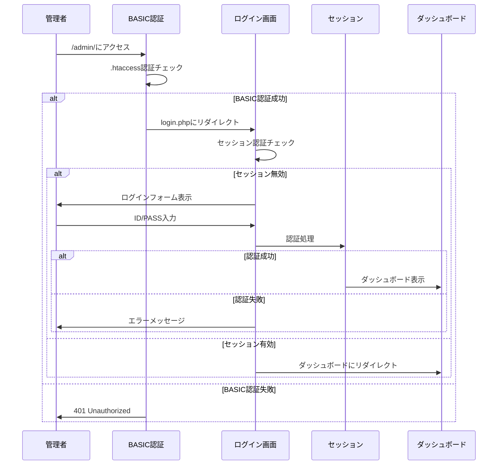

# REVI 管理画面システム仕様書

## 概要

REVIサイトの運営を効率的に行うための管理画面システムです。二重認証（BASIC認証 + セッション認証）によるセキュアな設計と、権限管理による段階的アクセス制御を実装しています。

## システム構成

### 認証フロー



### ディレクトリ構成

```
revi.mypressonline.com/
└── admin/                    # 管理画面ディレクトリ（公開）
    ├── .htaccess            # BASIC認証設定
    ├── index.php            # ダッシュボード
    ├── login.php            # ログイン画面
    ├── stores.php           # 店舗管理（未実装）
    ├── reviews.php          # レビュー管理（未実装）
    ├── tags.php             # タグ管理（未実装）
    ├── statistics.php       # 統計情報（未実装）
    ├── admins.php           # 管理者管理（未実装）
    └── settings.php         # 設定画面（未実装）

system/                       # 非公開システムディレクトリ
├── config/
│   ├── admin_config.php     # 管理画面設定
│   └── .htpasswd           # BASIC認証用ユーザーファイル
├── lib/
│   └── Admin.php           # 管理者クラス
└── logs/                   # ログディレクトリ（自動作成）
    └── admin.log           # 管理者操作ログ
```

## 認証システム

### BASIC認証

- **設定ファイル**: `admin/.htaccess`
- **認証ファイル**: `system/config/.htpasswd`
- **認証レルム**: "REVI Admin Area - 管理者専用エリア"

#### 認証ユーザー

| ユーザー名 | パスワード | 説明 |
|----------|----------|------|
| admin | admin123 | 管理者用アカウント |

### セッション認証

- **セッション名**: `revi_admin_session`
- **有効期限**: 1時間
- **再生成間隔**: 5分
- **セキュリティ**: HttpOnly, SameSite=Strict

## 権限管理

### 権限レベル

#### admin権限
全ての機能にアクセス可能
- dashboard（ダッシュボード）
- stores_manage（店舗管理）
- reviews_manage（レビュー管理）
- tags_manage（タグ管理）
- admins_manage（管理者管理）
- statistics（統計情報）
- settings（設定）

#### editor権限
限定的な機能のみアクセス可能
- dashboard（ダッシュボード）
- reviews_manage（レビュー管理）
- statistics（統計情報）

### 権限チェック関数

```php
Admin::hasPermission($permission)
```

## セキュリティ対策

### 実装済み対策

1. **二重認証システム**
   - BASIC認証による第一段階の保護
   - セッション認証による詳細な権限管理

2. **セッション保護**
   - セッション固定攻撃対策（ログイン時のID再生成）
   - セッションハイジャック対策（定期的なID再生成）
   - セッションタイムアウト

3. **ログイン保護**
   - ログイン試行回数制限（5回まで）
   - アカウントロックアウト（15分間）
   - ログイン履歴記録

4. **CSRF対策**
   - トークン生成・検証機能実装
   - 全フォームでの検証必須

5. **XSS対策**
   - 全出力でのHTMLエスケープ
   - セキュリティヘッダーの設定

6. **その他**
   - エラー情報の適切な制御
   - セキュリティログの記録

### セキュリティヘッダー

`.htaccess`で以下のセキュリティヘッダーを設定：

```apache
X-Content-Type-Options: nosniff
X-Frame-Options: DENY
X-XSS-Protection: 1; mode=block
Referrer-Policy: strict-origin-when-cross-origin
Content-Security-Policy: default-src 'self'; script-src 'self' 'unsafe-inline'; style-src 'self' 'unsafe-inline'; img-src 'self' data:; font-src 'self'
```

## データベース設計

### 既存テーブル活用

#### adminsテーブル
```sql
CREATE TABLE admins (
    id INT AUTO_INCREMENT PRIMARY KEY,
    username VARCHAR(50) NOT NULL UNIQUE,
    password_hash VARCHAR(255) NOT NULL,
    email VARCHAR(255) NOT NULL UNIQUE,
    display_name VARCHAR(100) NOT NULL,
    role ENUM('admin', 'editor') DEFAULT 'editor',
    is_active BOOLEAN DEFAULT TRUE,
    last_login_at TIMESTAMP NULL,
    created_at TIMESTAMP DEFAULT CURRENT_TIMESTAMP,
    updated_at TIMESTAMP DEFAULT CURRENT_TIMESTAMP ON UPDATE CURRENT_TIMESTAMP
);
```

#### 初期データ
```sql
INSERT INTO admins (username, password_hash, email, display_name, role) VALUES
('admin', '$2y$10$92IXUNpkjO0rOQ5byMi.Ye4oKoEa3Ro9llC/.og/at2.uheWG/igi', 'admin@diglog.local', '管理者', 'admin');
```

## 実装されたクラス

### Admin.php

管理者認証とセッション管理を担当するメインクラス

#### 主要メソッド

| メソッド | 説明 | 戻り値 |
|---------|------|-------|
| `authenticate($username, $password)` | 管理者認証 | array\|false |
| `createSession($admin)` | セッション作成 | bool |
| `checkSession()` | セッション確認 | bool |
| `destroySession()` | セッション破棄 | void |
| `hasPermission($permission)` | 権限チェック | bool |
| `getCurrentAdmin()` | 現在の管理者情報取得 | array\|null |
| `generateCSRFToken()` | CSRFトークン生成 | string |
| `verifyCSRFToken($token)` | CSRFトークン検証 | bool |
| `logAction($action, $details)` | 操作ログ記録 | void |

## 設定ファイル

### admin_config.php

```php
return [
    'session' => [
        'name' => 'revi_admin_session',
        'lifetime' => 3600,
        'regenerate_interval' => 300,
        'cookie_secure' => false,
        'cookie_httponly' => true,
        'cookie_samesite' => 'Strict'
    ],
    'security' => [
        'max_login_attempts' => 5,
        'lockout_duration' => 900,
        'csrf_token_name' => 'revi_csrf_token',
        'password_min_length' => 8
    ],
    'permissions' => [
        'admin' => ['dashboard', 'stores_manage', 'reviews_manage', 'tags_manage', 'admins_manage', 'statistics', 'settings'],
        'editor' => ['dashboard', 'reviews_manage', 'statistics']
    ]
];
```

## ダッシュボード機能

### 表示情報

1. **統計情報**
   - 総店舗数
   - 総レビュー数
   - 今日のレビュー数
   - 平均評価

2. **最新活動**
   - 最新レビュー5件
   - 投稿者情報
   - 評価（星表示）
   - 投稿日時

3. **ナビゲーションメニュー**
   - 権限に応じた表示制御
   - 将来の機能拡張に対応

## ログ機能

### 記録される情報

- ログイン/ログアウト
- 認証失敗
- 管理者操作（設定で有効化時）
- IPアドレス
- タイムスタンプ

### ログファイル

- **場所**: `system/logs/admin.log`
- **フォーマット**: `[YYYY-MM-DD HH:mm:ss] ACTION - User: username, IP: xxx.xxx.xxx.xxx, Details: details`

## 今後の拡張予定

### Phase 2: 管理機能実装
1. **店舗管理** (`stores.php`)
   - 店舗一覧・検索・編集
   - 店舗情報の追加・削除
   - 画像管理

2. **レビュー管理** (`reviews.php`)
   - レビュー一覧・検索・フィルタ
   - レビュー承認・削除
   - スパム対策

3. **タグ管理** (`tags.php`)
   - タグの追加・編集・削除
   - タグの色設定

### Phase 3: 高度な機能
1. **統計情報** (`statistics.php`)
   - 詳細な統計レポート
   - グラフ表示
   - データエクスポート

2. **管理者管理** (`admins.php`)
   - 管理者アカウントの追加・編集
   - 権限変更
   - ログイン履歴

3. **設定画面** (`settings.php`)
   - サイト設定
   - メール設定
   - セキュリティ設定

## 運用上の注意点

### セキュリティ
1. 定期的なパスワード変更
2. ログファイルの定期的な確認
3. 不要な管理者アカウントの無効化

### パフォーマンス
1. ログファイルのローテーション
2. セッションファイルの定期清掃
3. データベースの定期メンテナンス

### バックアップ
1. 設定ファイルのバックアップ
2. ログファイルのアーカイブ
3. データベースの定期バックアップ

## トラブルシューティング

### よくある問題

1. **BASIC認証が通らない**
   - `.htpasswd`ファイルのパスを確認
   - Apacheの設定確認

2. **セッションが維持されない**
   - PHPのセッション設定確認
   - ディスク容量の確認

3. **権限エラー**
   - 管理者の権限レベル確認
   - データベースの`role`カラム確認

### ログの確認方法

```bash
# 管理者ログの確認
tail -f system/logs/admin.log

# エラーログの確認
tail -f system/logs/admin_error.log
```

## 変更履歴

| 日付 | バージョン | 変更内容 | 担当者 |
|------|----------|----------|--------|
| 2025/06/13 | 1.0.0 | 管理画面システム基盤実装 | roo |

---

*このドキュメントはroocode開発ルールに従って作成・管理されています。*