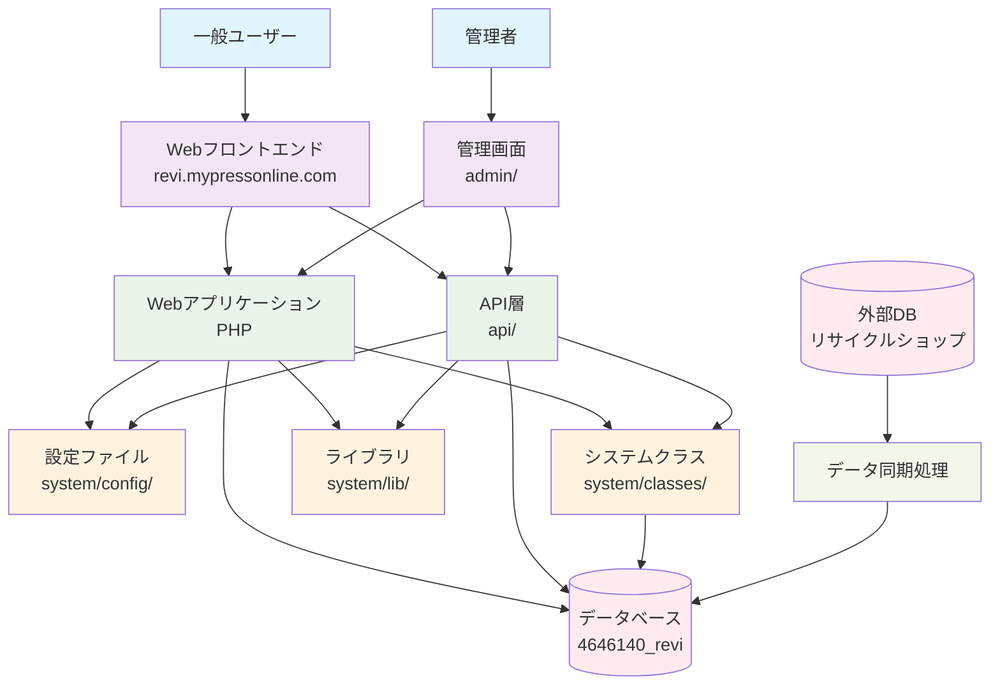
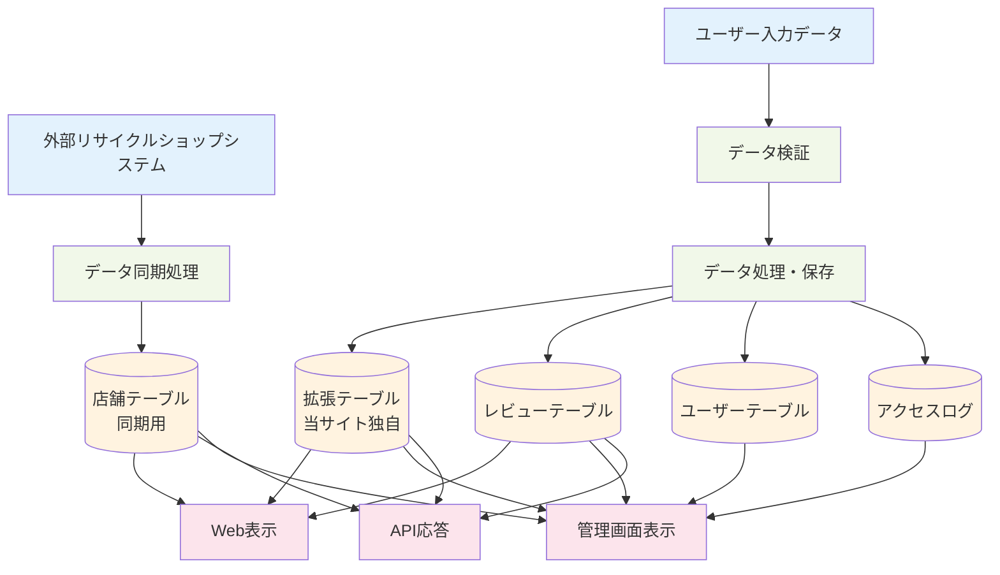
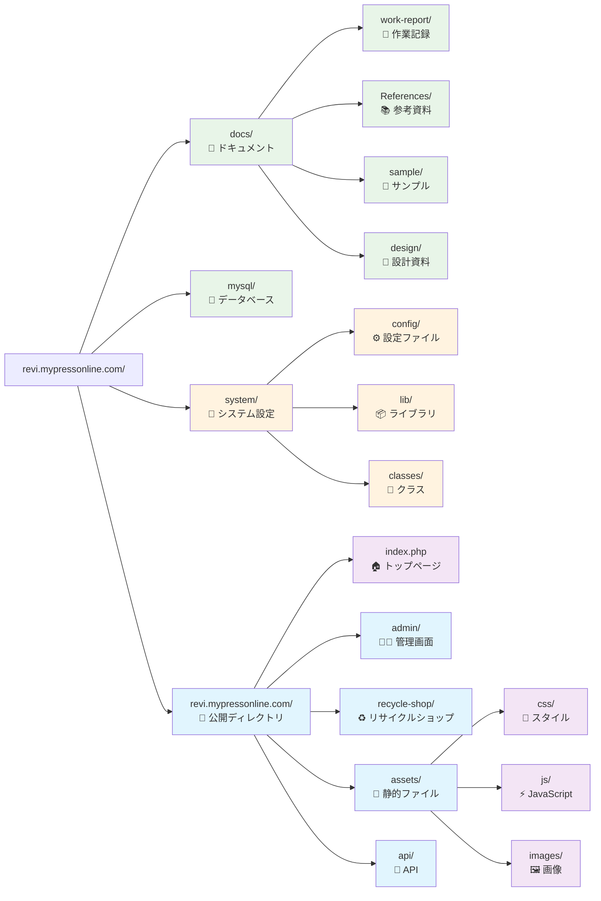
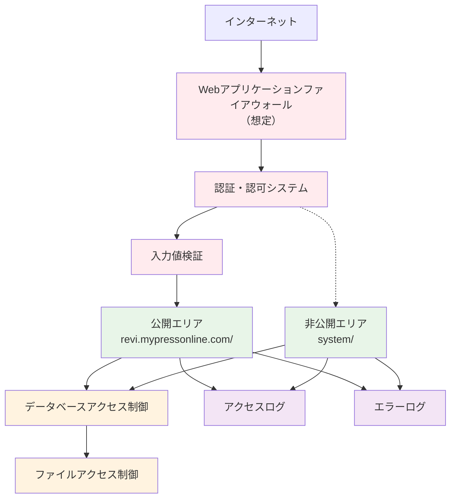

# Revi プロジェクト システム相関図

## システム全体構成図

---

## データフロー図

---

## ディレクトリ構造図

---

## セキュリティ層構成

---

## 更新履歴
- 2025/6/14: 初版作成
- システム全体構成図、データフロー図、ディレクトリ構造図、セキュリティ層構成を作成

---

## 注意事項
- この設計図は実装の指針として使用すること
- 設計変更時は必ずこのファイルも更新すること
- Mermaid記法により、GitHub等での表示が可能