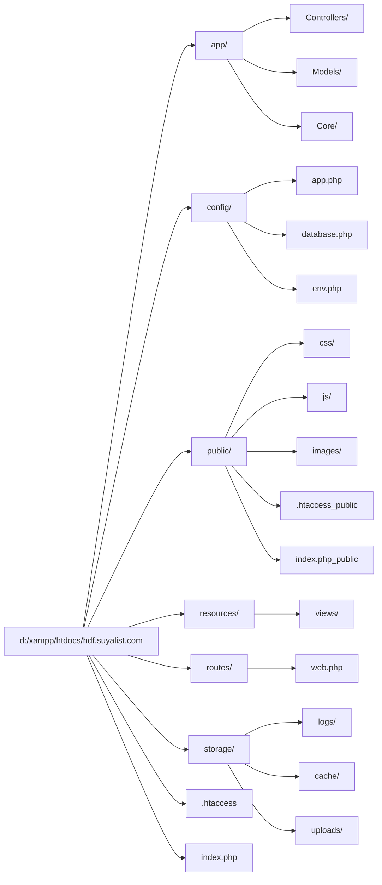
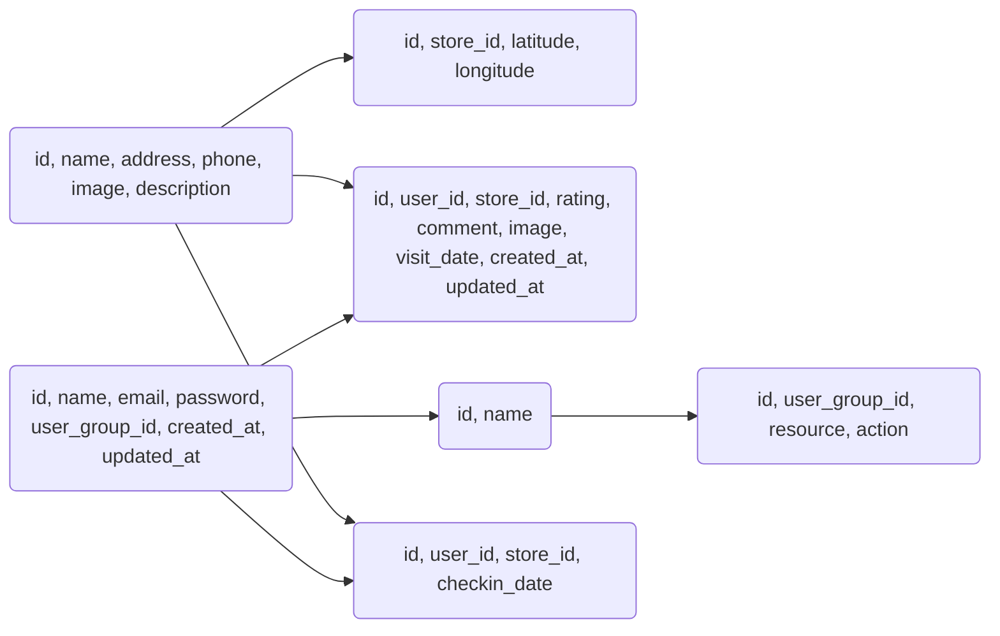

# ハードオフ店舗レビューサイト 基本構造設計

## 1. ディレクトリ構造



*   **app/:** アプリケーションのロジックを格納します。
    *   **Controllers/:** コントローラーを格納します。
    *   **Models/:** モデルを格納します。
    *   **Core/:** コア機能を格納します (例: Bootstrap, Router)。
*   **config/:** 設定ファイルを格納します。
    *   **app.php:** アプリケーション全体の設定。
    *   **database.php:** データベース接続の設定。
    *   **env.php:** 環境変数の設定。
*   **public/:** 公開ファイルを格納します。
    *   **css/:** CSSファイルを格納します。
    *   **js/:** JavaScriptファイルを格納します。
    *   **images/:** 画像ファイルを格納します。
    *   **.htaccess:** Apacheの設定ファイル。
    *   **index.php:** エントリーポイント。
*   **resources/:** ビューファイルを格納します。
    *   **views/:** テンプレートファイルを格納します。
*   **routes/:** ルーティング定義を格納します。
    *   **web.php:** Webルーティング。
*   **storage/:** アプリケーションが生成するファイルを格納します。
    *   **logs/:** ログファイルを格納します。
    *   **cache/:** キャッシュファイルを格納します。
    *   **uploads/:** アップロードされたファイルを格納します。
*   **.htaccess:** Apacheの設定ファイル。
*   **index.php:** エントリーポイント。

## 2. 設定ファイル構造

*   **env.php:**
    *   環境変数 (例: データベース接続情報、APIキー)。
    *   開発環境と本番環境で異なる値を設定できるようにします。
*   **database.php:**
    *   データベース接続設定 (例: ホスト、データベース名、ユーザー名、パスワード)。
*   **app.php:**
    *   アプリケーション全体の設定 (例: アプリケーション名、タイムゾーン、ロケール)。

## 3. データベース構造



*   **stores:** 店舗情報を格納します。
    *   `id`: INT (Primary Key)
    *   `name`: VARCHAR(255)
    *   `address`: VARCHAR(255)
    *   `phone`: VARCHAR(20)
    *   `image`: VARCHAR(255) (画像URL)
    *   `description`: TEXT
*   **store\_locations:** 店舗の場所情報を格納します。
    *   `id`: INT (Primary Key)
    *   `store\_id`: INT (Foreign Key to stores.id)
    *   `latitude`: DECIMAL(10, 8)
    *   `longitude`: DECIMAL(11, 8)
*   **reviews:** レビュー情報を格納します。
    *   `id`: INT (Primary Key)
    *   `user\_id`: INT (Foreign Key to users.id)
    *   `store\_id`: INT (Foreign Key to stores.id)
    *   `rating`: INT (1-5)
    *   `comment`: TEXT
    *   `image`: VARCHAR(255) (画像URL)
    *   `visit_date`: DATE (訪問日、任意)
    *   `created\_at`: TIMESTAMP (書き込み日)
    *   `updated\_at`: TIMESTAMP
*   **users:** ユーザー情報を格納します。
    *   `id`: INT (Primary Key)
    *   `name`: VARCHAR(255)
    *   `email`: VARCHAR(255) (Unique)
    *   `password`: VARCHAR(255)
    *   `user_group_id`: INT (Foreign Key to user_groups.id)
    *   `created\_at`: TIMESTAMP
    *   `updated\_at`: TIMESTAMP
*   **user\_groups:** ユーザー権限グループ情報を格納します。
    *   `id`: INT (Primary Key)
    *   `name`: VARCHAR(255)
*   **permissions:** 権限情報を格納します。
    *   `id`: INT (Primary Key)
    *   `user\_group\_id`: INT (Foreign Key to user\_groups.id)
    *   `resource`: VARCHAR(255) (リソース名、例: stores, reviews)
    *   `action`: VARCHAR(255) (アクション名、例: create, read, update, delete)
*   **checkin\_histories:** チェックイン履歴を格納します。
    *   `id`: INT (Primary Key)
    *   `user\_id`: INT (Foreign Key to users.id)
    *   `store\_id`: INT (Foreign Key to stores.id)
    *   `checkin_date`: DATE

## 4. オートロード機能

PHPの`spl_autoload_register`関数を使用して、クラスを自動的にロードします。

1.  `app/Core/Bootstrap.php` でオートロード関数を定義します。
2.  `index.php` で `Bootstrap.php` をインクルードし、オートロード関数を登録します。

```php
// 例: Bootstrap.php
spl_autoload_register(function ($class) {
    $path = str_replace('\\', '/', $class) . '.php';
    if (file_exists($path)) {
        require_once $path;
    }
});